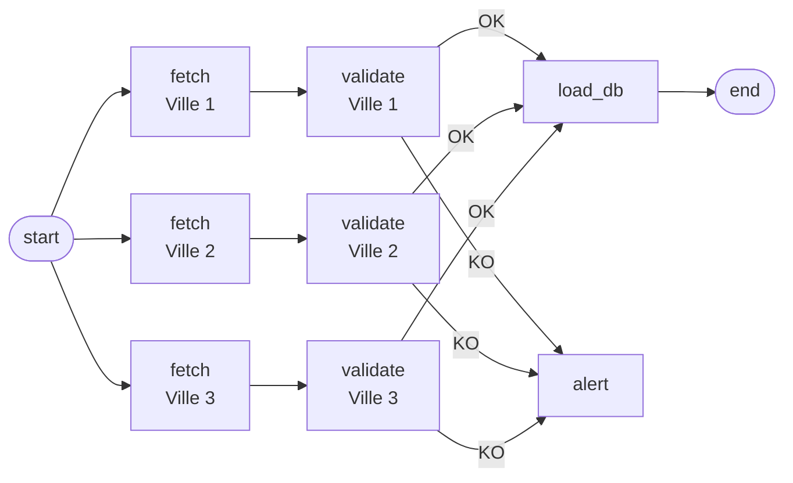

# TP 1 — Pipeline météo quotidien

## Schéma du DAG

---

1. 
   - Extraction des data météo via une API, 
   - validation de leur intégrité 
   - chargement en BDD

2. 
    Découpage en tâche `fetch`, `validate` indépendant par ville et `load_db` qui centralise l'insertion en BDD et `alert` qui gère les notifications d'échec

3. 
   Chaque `validate_villeX` dépend de son `fetch_villeX`. La tâche `load_db` dépend de toutes les validations. 

4. Les 3 `fetch` s'execute en parralèle, idem pour les `validate` après leur fetch

5. Voir image

6. Si l'appel échoue, ça marque la tâche `fetch_villeX` en échec dans Airflow. On peut imaginer la pipeline qui tente de relancer automatiquement jusqu'à 3 relances avec un délai entre chaque retry.

7. `validate_villeX` vérifie la présence des champs primordiaux (température, humidité, date/heure) tout en restant cohérent. Si la validation échoue alors on redirige vers `alert` et `load_db` est skippée pour la ville en question. Les autres ne seront pas impactées  
