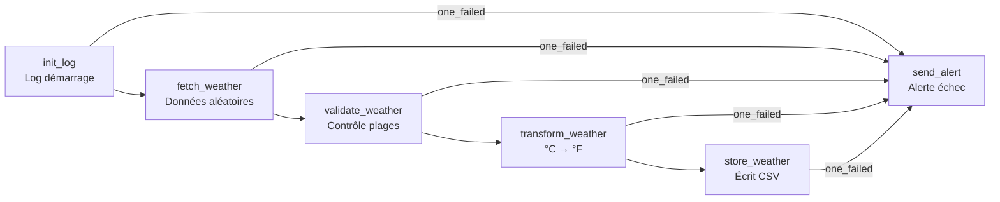
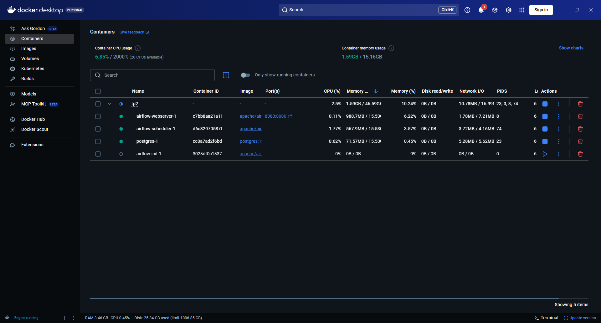
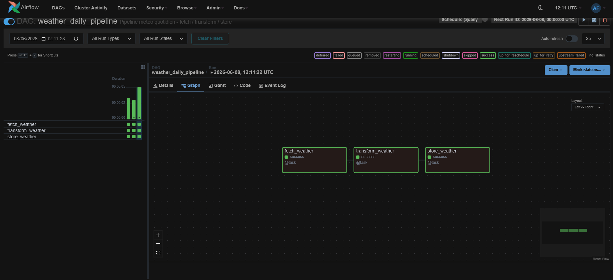
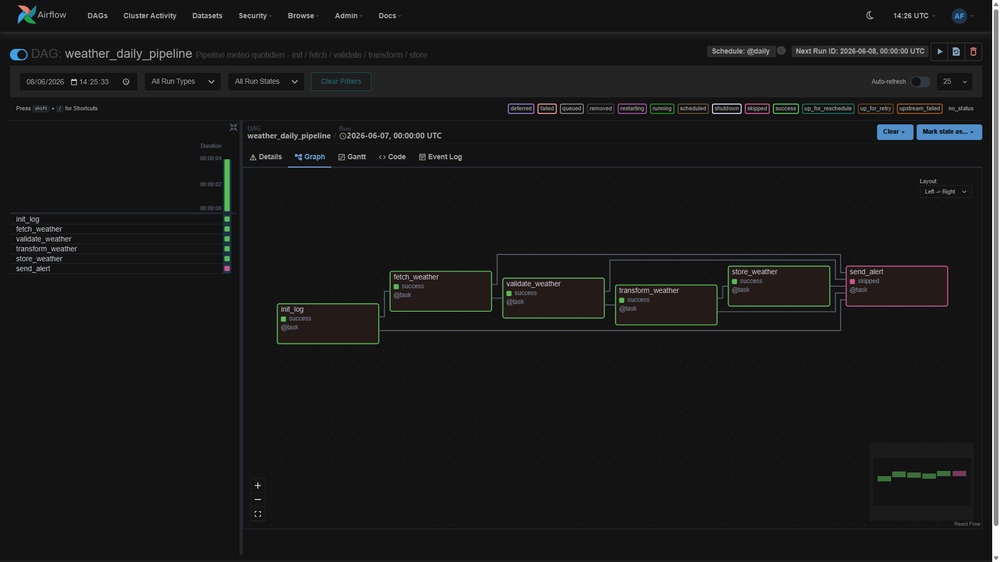
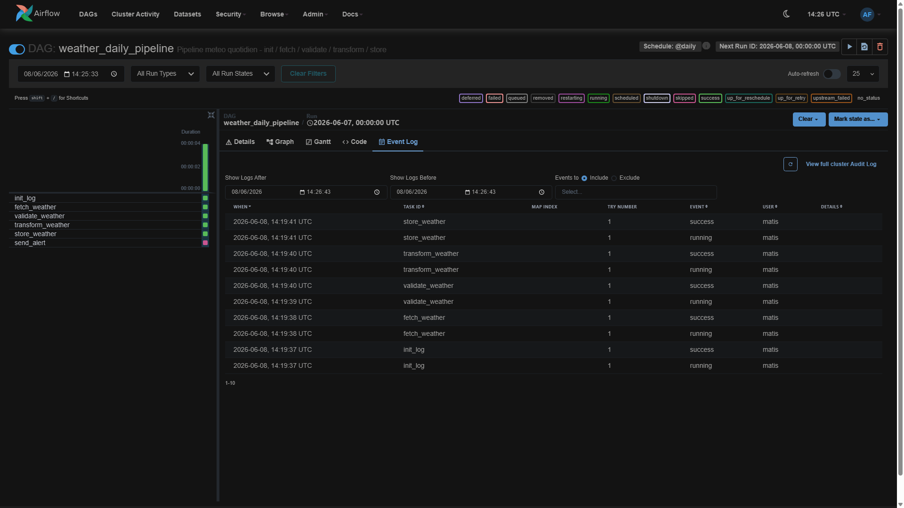

# TP2 — Créer un premier DAG Airflow

Environnement Docker Airflow + un DAG à 6 tâches : `weather_daily_pipeline`.
> Données simulées (pas d'appel API réel, pas de BDD réelle)





## Arborescence

```
TP2/
├── docker-compose.yaml          # environnement Airflow (LocalExecutor + Postgres)
├── .env                         # variables actives (copie de .env.example)
├── .env.example                 # template avec valeurs par défaut
├── dags/
│   └── weather_daily_pipeline.py
├── logs/
│   └── weather_output.csv       # sortie CSV générée par store_weather
├── plugins/  config/            # vides
├── preuve_execution.txt         # preuve d'exécution
└── README.md
```

## Lancer l'environnement

```bash
cp .env.example .env                # (une seule fois) créer le .env
docker compose up airflow-init      # (une seule fois) migration BDD + création admin
docker compose up -d                # démarre scheduler + webserver
```

Interface web : http://localhost:8080 — identifiants `airflow` / `airflow`.

## Lancer le DAG manuellement

Depuis l'UI : bouton ▶ (*Trigger DAG*) sur `weather_daily_pipeline`.

## Consulter les logs d'une tâche

UI : *DAG → Grid → clic sur une tâche → onglet Logs*.

Ou sur disque : `logs/dag_id=weather_daily_pipeline/run_id=.../task_id=.../attempt=1.log`

## Le DAG : rôle de chaque tâche

| Tâche | Rôle |
|-------|------|
| `init_log` | Log les métadonnées du run (run_id, date). Point de départ. |
| `fetch_weather` | Génère des mesures météo simulées pour Paris, Berlin, Madrid. |
| `validate_weather` | Vérifie que temp_c ∈ [-50, 60] et humidity ∈ [0, 100]. |
| `transform_weather` | Convertit la température °C → °F. |
| `store_weather` | Écrit le résultat dans `logs/weather_output.csv`. |
| `send_alert` | Se déclenche si **une** tâche amont échoue (`trigger_rule=one_failed`), skippée sinon. |

## Comment ça marche

- Le **scheduler** parse `dags/`, sérialise le DAG en base et crée un **DAG run** au déclenchement.
- Les valeurs passent entre tâches via **XCom** (valeur retournée = entrée de la suivante).
- `send_alert` dépend de toutes les étapes : Airflow le passe en `skipped` si tout réussit, le déclenche dès qu'une tâche échoue.

## Captures d'écran — avant / après

### Avant (DAG initial — 3 tâches)
> `fetch_weather → transform_weather → store_weather`




---

### Après (DAG amélioré — 6 tâches)
> Ajout de `init_log`, `validate_weather`, `send_alert`



**Logs d'une tâche — exemple `store_weather`**



---

## Arrêter

```bash
docker compose down        # arrête les conteneurs
docker compose down -v     # + supprime la base de métadonnées
```
