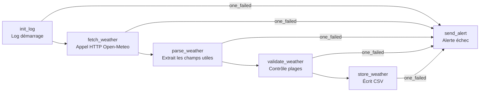

# TP2A — Ingestion API météo (Open-Meteo)

DAG `weather_daily_pipeline` (TP2A) — appel réel à l'API Open-Meteo pour Paris, Berlin, Madrid.
> API gratuite, sans clé — données réelles récupérées à chaque run.



## Isolation Docker — TP2 vs TP2A

`docker compose up` lancé depuis `TP2A/` ne démarre **que** la stack TP2A.

Docker Compose utilise le nom du dossier comme préfixe de projet :
- TP2  → conteneurs `tp2-airflow-scheduler-1`, `tp2-postgres-1`, …
- TP2A → conteneurs `tp2a-airflow-scheduler-1`, `tp2a-postgres-1`, …

Les deux stacks sont **complètement indépendantes** (volumes séparés, réseaux séparés).  
⚠️ Elles utilisent toutes les deux le port **8080** — ne pas les lancer en même temps.

## Arborescence

```
TP2A/
├── docker-compose.yaml
├── .env                         # variables actives (copie de .env.example)
├── .env.example                 # template avec valeurs par défaut
├── dags/
│   └── weather_daily_pipeline.py
├── logs/
│   └── weather_openmeteo.csv    # sortie CSV générée par store_weather
├── livrable/
│   └── champs_retenus.md        # champs retenus et justification
├── plugins/  config/
└── README.md
```

## Lancer l'environnement

```bash
# Depuis le dossier TP2A/
cp .env.example .env                  # (une seule fois)
docker compose up airflow-init        # (une seule fois) migration BDD + création admin
docker compose up -d                  # démarre scheduler + webserver
```

Interface web : http://localhost:8080 — identifiants `airflow` / `airflow`.

## Lancer le DAG manuellement

Depuis l'UI : bouton ▶ sur `weather_daily_pipeline`.

## Le DAG : rôle de chaque tâche

| Tâche | Rôle |
|-------|------|
| `init_log` | Log run_id et logical_date au démarrage. |
| `fetch_weather` | Appelle l'API Open-Meteo pour chaque ville, retourne le JSON brut. |
| `parse_weather` | Extrait les 4 champs utiles, écarte les métadonnées API (voir `livrable/champs_retenus.md`). |
| `validate_weather` | Vérifie temp ∈ [-50, 60], humidity ∈ [0, 100], vent ∈ [0, 500]. |
| `store_weather` | Écrit `logs/weather_openmeteo.csv` (structure prête pour future table SQL). |
| `send_alert` | `trigger_rule=one_failed` — skippée si tout réussit, se déclenche sur tout échec. |

## Champs retenus (aperçu)

Voir [`livrable/champs_retenus.md`](livrable/champs_retenus.md) pour la justification complète.

| Colonne CSV | Source API | Description |
|---|---|---|
| `city` | injecté | Nom de la ville |
| `measured_at` | `current.time` | Horodatage de la mesure |
| `temp_c` | `current.temperature_2m` | Température en °C |
| `humidity_pct` | `current.relative_humidity_2m` | Humidité relative en % |
| `wind_kmh` | `current.wind_speed_10m` | Vent à 10 m en km/h |
| `fetched_at` | calculé | Horodatage d'ingestion |

## Arrêter

```bash
docker compose down        # arrête les conteneurs
docker compose down -v     # + supprime la base de métadonnées
```
