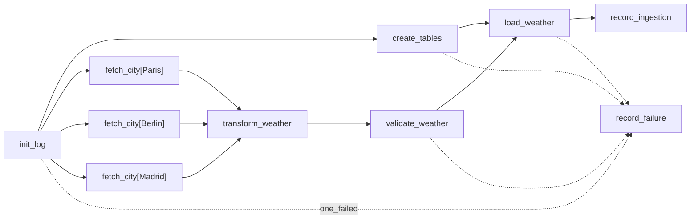

# TP2B — Pipeline complet API → transformation → PostgreSQL

DAG `weather_daily_pipeline` (TP2B) pipeline ETL orchestré : Open-Meteo → transformation → chargement **PostgreSQL** + table de suivi d'ingestion.



## Architecture

Deux bases PostgreSQL **séparées** (séparation claire des responsabilités) :

| Service      | Rôle                                     | Port hôte |
| ------------ | ---------------------------------------- | --------- |
| `postgres`   | métadonnées internes Airflow             | —         |
| `weather-db` | **données métier** (cible du chargement) | `5433`    |

Le DAG accède à `weather-db` via une **connexion Airflow** (`weather_db`), définie par la variable `AIRFLOW_CONN_WEATHER_DB` du `.env` — aucun identifiant en dur dans le code.

## Tables (script SQL : [`sql/schema.sql`](sql/schema.sql))

- **`weather_measurements`** (table cible) — une ligne par ville/horodatage, clé d'unicité `(city, measured_at)` pour un upsert idempotent.
- **`ingestion_log`** (table de suivi) — une ligne par run : source, période, statut, lignes reçues/insérées, erreur, horodatage.

## Lancer l'environnement

```bash
# Depuis le dossier TP2B/  (arrêter TP2/TP2A d'abord : ils partagent le port 8080)
cp .env.example .env
docker compose up airflow-init        # (une seule fois) migration + admin
docker compose up -d                  # postgres + weather-db + scheduler + webserver
```

Interface web : http://localhost:8080 — `airflow` / `airflow`.

## Lancer le DAG

UI : bouton ▶ sur `weather_daily_pipeline`. Ou CLI :

```bash
docker compose exec airflow-scheduler airflow dags trigger weather_daily_pipeline
```

## Vérifier le chargement

```bash
docker compose exec weather-db psql -U weather -d weather -c "SELECT * FROM weather_measurements;"
docker compose exec weather-db psql -U weather -d weather -c "SELECT * FROM ingestion_log;"
```

Sortie capturée dans [`livrable/preuve_chargement.txt`](livrable/preuve_chargement.txt).

## Le DAG : rôle de chaque tâche

| Tâche               | Étape ETL     | Rôle                                                                      |
| ------------------- | ------------- | ------------------------------------------------------------------------- |
| `init_log`          | x             | Log run_id et data interval au démarrage.                                 |
| `create_tables`     | x             | Applique `schema.sql` (idempotent).                                       |
| `fetch_city`        | **Extract**   | Appel API Open-Meteo, 1 instance par ville en parallèle (`expand`).       |
| `transform_weather` | **Transform** | Sélectionne les champs utiles, structure pour la table cible.             |
| `validate_weather`  | Transform     | Contrôle les plages (temp / humidité / vent).                             |
| `load_weather`      | **Load**      | Upsert dans `weather_measurements`, renvoie les compteurs.                |
| `record_ingestion`  | Traçabilité   | Écrit une ligne `success` dans `ingestion_log`.                           |
| `record_failure`    | Traçabilité   | `trigger_rule=one_failed` — écrit une ligne `failed` si une tâche échoue. |

## Paramétrage (pas de hardcode)

Tout est dans le `.env`, séparé en deux familles :

- **Métier** : `WEATHER_CITIES` (villes suivies).
- **Technique** : `AIRFLOW_CONN_WEATHER_DB`, `OPEN_METEO_URL`, `WEATHER_TABLE`, `INGESTION_TABLE`, identifiants des bases.

## Arrêter

```bash
docker compose down        # arrête les conteneurs
docker compose down -v     # + supprime les deux bases (métadonnées + métier)
```
