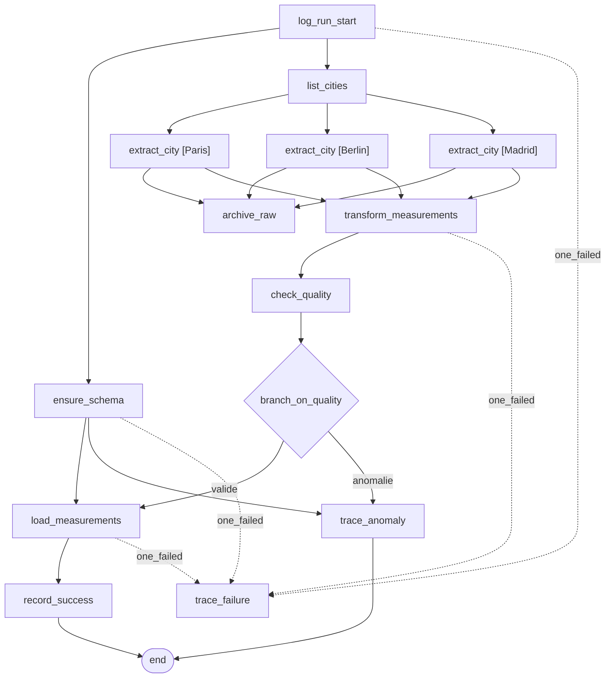

# TP5 — Industrialisation d'un pipeline Airflow Open-Meteo

DAG `weather_open_meteo_pipeline` : pipeline ETL industrialisé autour de l'API
Open-Meteo. Il récupère les données météo de plusieurs villes, **archive** les
réponses brutes, les **transforme**, contrôle leur **qualité**, **décide** par
branchement si elles peuvent être chargées dans PostgreSQL, puis **trace** le
résultat du run. Le pipeline est relançable sans créer de doublon.

## Description du pipeline

| Caractéristique | Choix                                                                                              |
| --------------- | -------------------------------------------------------------------------------------------------- |
| Orchestration   | Apache Airflow 2.10.5 (`LocalExecutor`)                                                            |
| Source          | API Open-Meteo (`/v1/forecast`, `current`)                                                         |
| Cible           | PostgreSQL (base métier séparée des métadonnées Airflow)                                           |
| Villes          | configurables via la Variable Airflow `weather_cities`                                             |
| Code            | logique métier en **modules Python séparés** (package `weather`), orchestration isolée dans le DAG |

## Schéma logique du pipeline — `weather_open_meteo_pipeline`



## Lecture

- **EXTRACT** : `list_cities` lit la Variable Airflow `weather_cities`, puis `extract_city`
  est *dynamiquement mappé* (une instance par ville, en parallèle).
- **ARCHIVE** : `archive_raw` persiste les réponses brutes sur disque avant transformation.
- **TRANSFORM** : `transform_measurements` structure une ligne par ville.
- **QUALITÉ + BRANCHEMENT** : `check_quality` produit un rapport ; `branch_on_quality`
  oriente vers `load_measurements` (données valides) **ou** `trace_anomaly` (chargement bloqué).
- **TRAÇABILITÉ** : `record_success` / `trace_anomaly` écrivent dans `ingestion_log` ;
  `trace_failure` (`trigger_rule=one_failed`) journalise tout échec technique.
- `end` (`none_failed_min_one_success`) clôt la branche réellement exécutée.


## Structure du projet

```
TP5/
├── dags/
│   ├── weather_pipeline_dag.py   # orchestration (DAG) uniquement
│   └── weather/                  # modules Python séparés
│       ├── config.py             # Variables Airflow, connexion, seuils
│       ├── extract.py            # appel API + archivage brut
│       ├── transform.py          # mise en forme des mesures
│       ├── quality.py            # contrôles qualité
│       ├── load.py               # upsert PostgreSQL
│       └── tracing.py            # schéma + journal d'ingestion + anomalies
├── sql/schema.sql                # DDL des 3 tables (idempotent)
├── data/raw/                     # archives brutes (générées à l'exécution)
├── docker-compose.yaml
├── .env / .env.example
└── livrable/                     # preuves d'exécution
```

La logique métier est isolée dans les modules Python de `weather/` (extraction, transformation, qualité, chargement, traçabilité). Le DAG `weather_pipeline_dag.py` orchestre les tâches en important ces modules, sans contenir de logique métier lui-même.

## Variables Airflow utilisées

| Variable                | Rôle                                      | Valeur par défaut             |
| ----------------------- | ----------------------------------------- | ----------------------------- |
| `weather_cities`        | villes à traiter (liste JSON ou CSV)      | `["Paris","Berlin","Madrid"]` |
| `weather_force_anomaly` | injecte une anomalie qualité pour la démo | `false`                       |

Semées automatiquement par le service `airflow-init` et visibles dans l'UI
(*Admin -> Variables*). Lues à l'exécution dans `weather/config.py`.

## Connexions Airflow utilisées

| Connexion    | Type     | Rôle                                      |
| ------------ | -------- | ----------------------------------------- |
| `weather_db` | postgres | accès à la base métier via `PostgresHook` |

Définie par `AIRFLOW_CONN_WEATHER_DB` dans le `.env`.

## Description des tâches du DAG

| Tâche                    | Étape           | Rôle                                                            |
| ------------------------ | --------------- | --------------------------------------------------------------- |
| `log_run_start`          | init            | Journalise `run_id` et l'intervalle de données.                 |
| `ensure_schema`          | init            | Applique `sql/schema.sql` (idempotent).                         |
| `list_cities`            | extract         | Lit `weather_cities` et renvoie les villes.                     |
| `extract_city`           | **Extract**     | Appel API Open-Meteo, 1 instance mappée par ville.              |
| `archive_raw`            | **Archive**     | Écrit les réponses brutes en JSON sur disque.                   |
| `transform_measurements` | **Transform**   | Structure une ligne par ville.                                  |
| `check_quality`          | Qualité         | Produit un rapport (valide + anomalies).                        |
| `branch_on_quality`      | **Branchement** | Route vers `load_measurements` ou `trace_anomaly`.              |
| `load_measurements`      | **Load**        | Upsert dans `weather_measurements`.                             |
| `record_success`         | Traçabilité     | Ligne `success` dans `ingestion_log`.                           |
| `trace_anomaly`          | Traçabilité     | Trace l'anomalie, marque `anomaly`, ne charge rien.             |
| `trace_failure`          | Erreur          | `trigger_rule=one_failed` - ligne `failed` si une tâche échoue. |
| `end`                    | join            | Clôt la branche exécutée (`none_failed_min_one_success`).       |

## Stratégie de robustesse

- **Retries** : 3 essais par défaut, `retry_delay` 2 min ; `extract_city`
  (appel réseau) a un délai court de 30 s.
- **Timeout** : `execution_timeout` de 5 min par tâche - pas de tâche bloquée.
- **Timeout réseau** : `requests` borné à 10 s sur l'appel API.
- **`raise_for_status`** sur la réponse HTTP ->un appel échoué part en retry.
- **Gestion d'erreur** : `trace_failure` (`one_failed`) journalise tout échec
  technique dans `ingestion_log`, en réappliquant le schéma au cas où.
- **`max_active_runs=1`** : pas de chevauchement de runs concurrents.
- **Séparation des bases** : métadonnées Airflow et données métier sur deux
  instances PostgreSQL distinctes.

## Stratégie d'idempotence

- **Chargement** : `INSERT ... ON CONFLICT (city, measured_at) DO UPDATE`
  (upsert). Une relance met à jour la mesure au lieu de dupliquer.
- **Journal d'ingestion** : `ingestion_log.run_id` est unique, écrit en upsert :
  un run = une ligne, même après relance.
- **Anomalies** : `trace_anomaly` purge les lignes du run avant réinsertion.
- **Archivage** : nom de fichier déterministe par `run_id`/ville ->la relance
  écrase l'archive existante.
- **Schéma** : `CREATE TABLE IF NOT EXISTS` (rejouable sans effet de bord).

## Contrôles qualité mis en place

`weather/quality.py` vérifie chaque mesure (valeur nulle = anomalie) :

| Champ          | Borne acceptée |
| -------------- | -------------- |
| `temp_c`       | -50 / 60 °C   |
| `humidity_pct` | 0 / 100 %     |
| `wind_kmh`     | 0 / 500 km/h  |

Le rapport liste chaque anomalie (ville, champ, valeur, règle).

## Règle de branchement conditionnel

`branch_on_quality` lit le rapport qualité :

- **rapport valide** ->`load_measurements` (chargement + `record_success`) ;
- **au moins une anomalie** ->`trace_anomaly` (aucun chargement, anomalie tracée).

Le contrôle est **global au lot** : une seule mesure invalide bloque le
chargement de tout le run, conformément à la consigne.

## Description des logs produits

- **Logs applicatifs** (`logging`) par tâche, consultables dans l'UI Airflow
  (*Task ->Logs*) et persistés sous `logs/` : démarrage du run, code HTTP par
  ville, chemins d'archive, nombre de lignes transformées/chargées, verdict
  qualité, sens du branchement, statut écrit en base.
- **Anomalie** : `transform` et `quality` émettent des `warning` explicites.
- **Traçabilité base** : `ingestion_log` (un run = une ligne) + `quality_issues`
  (détail des anomalies).

## Description des tables PostgreSQL

| Table                  | Rôle                                   | Clé / unicité                   |
| ---------------------- | -------------------------------------- | ------------------------------- |
| `weather_measurements` | mesures chargées (cible)               | `UNIQUE (city, measured_at)`    |
| `ingestion_log`        | suivi par run : statut, lignes, erreur | `UNIQUE (run_id)`               |
| `quality_issues`       | détail des anomalies qualité           | par `run_id` / `city` / `field` |

DDL : [`sql/schema.sql`](sql/schema.sql).

## Mise en route

```bash
# Depuis TP5/  (arrêter les autres TP : port 8080 partagé)
cp .env.example .env
docker compose up airflow-init     # migration + admin + Variables (une fois)
docker compose up -d               # postgres + weather-db + scheduler + webserver
```

UI : http://localhost:8080 - `airflow` / `airflow`.

## Démonstration des trois cas

```bash
# 1. Cas nominal
docker compose exec airflow-scheduler airflow dags trigger weather_open_meteo_pipeline

# 2. Cas d'anomalie qualité (toggle Variable -> rejouer)
docker compose exec airflow-scheduler airflow variables set weather_force_anomaly true
docker compose exec airflow-scheduler airflow dags trigger weather_open_meteo_pipeline
docker compose exec airflow-scheduler airflow variables set weather_force_anomaly false

# 3. Cas de relance sans doublon (rejouer tout le run, ou seulement le chargement)
ED=$(docker compose exec -T airflow-scheduler airflow dags list-runs -d weather_open_meteo_pipeline -o json | python -c "import sys,json;print(json.load(sys.stdin)[0]['logical_date'])")
docker compose exec airflow-scheduler airflow tasks clear weather_open_meteo_pipeline -s "$ED" -e "$ED" -y            # relance complète
docker compose exec airflow-scheduler airflow tasks clear weather_open_meteo_pipeline -t load_measurements --downstream -s "$ED" -e "$ED" -y   # relance partielle (load seul)
```

## Vérifier les tables

```bash
docker compose exec weather-db psql -U weather -d weather -c "SELECT * FROM weather_measurements ORDER BY city, measured_at;"
docker compose exec weather-db psql -U weather -d weather -c "SELECT run_id, status, rows_inserted, error FROM ingestion_log;"
docker compose exec weather-db psql -U weather -d weather -c "SELECT * FROM quality_issues;"
```

## Limites éventuelles

- Anomalie qualité simulée via un toggle (`weather_force_anomaly`), pas issue
  d'un cas réel de l'API.
- Référentiel de villes restreint à `Paris`, `Berlin`, `Madrid` (coordonnées en
  dur dans `config.CITY_COORDS`).
- Pas d'alerting externe (mail/Slack) : la traçabilité reste en base et en logs.

## Arrêter

```bash
docker compose down       # arrête les conteneurs
docker compose down -v    # + supprime les bases (métadonnées + métier)
```
